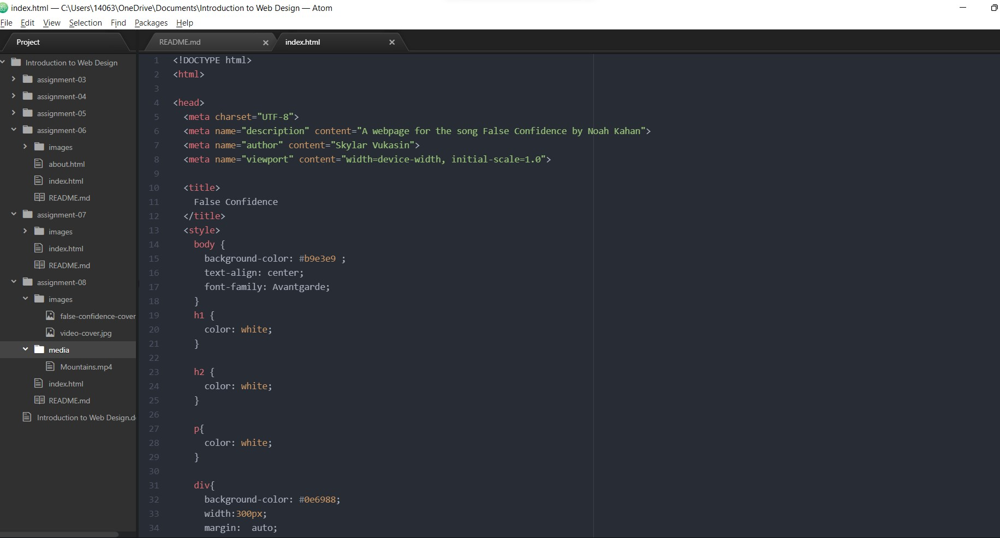

### What is an affordance?
- An affordance is the perceived or actual properties of an object. Basically, what the object is used for or what it does.

### What are the advantages and disadvantages of using a third-party service like YouTube or Vimeo to host your videos?
- Advantages: These services allow for large, high-quality versions of the file to be hosted on their central location. They also handle all the details needed for different browsers such as encoding and compatibility. This takes a lot of work off the owner of the file as they don't need to manually ensure these are taken care of. This also allows multiple files to be found and searchable in one location.

- Disadvantages: Permissions - any unlicensed materials can be flagged and reported (i.e. music without permissions). Security for the owner of the content. There is a fine line between highly protected content and easily accessible (and downloadable) content.

### What challenges did you face this week with this assignment? How did you overcome them?
- I had a really hard time finding a video I could embed in my site. Almost all the videos I found (music video, lyric video, cover artist, dance video) were protected and couldn't be embedded. It took some extra searching and trying to find one I could embed. Is there a way to look at the embed code and see if the video will show up when embedded or is it just trial and error?

